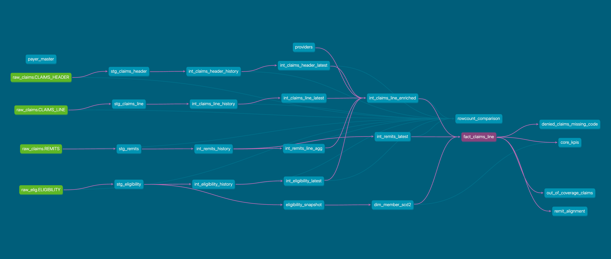

# Healthcare Revenue Cycle & Utilization Analytics (RCM)

This project demonstrates an **end-to-end revenue cycle management (RCM) pipeline** for healthcare, built using **dbt on Snowflake**.  
The goal is to model how **eligibility, claims, and remittance data** can be transformed into reliable, analytics-ready facts and dimensions.  

⚠️ **Note:** The data used here is **test/synthetic data** to illustrate the design. In real-world healthcare RCM systems:  
- Data volumes are much larger.  
- Multiple teams (data engineering, actuarial, billing, compliance) are involved.  
- Governance and PHI/PII compliance add additional complexity.  

This project is intended as a **technical showcase of how US healthcare pipelines work with dbt for transformation**, not as a production-ready implementation.  

---

## Purpose

Healthcare providers and payers face challenges in understanding:  
- **Who is covered (eligibility)?**  
- **What was billed vs allowed vs paid (claims & remits)?**  
- **Why were denials issued (adjudication outcomes)?**  

This pipeline delivers:  
- **Operational dashboards** (daily latest view).  
- **Historical trend tracking** (auditability).  
- **Financial transparency** into billing vs adjudicated outcomes.  

---

## Architecture

We adopted a **Medallion-style design** for clarity and auditability:

```
Raw (S3) → Staging (RCM_STAGING) → Intermediate (RCM_INTERMEDIATE) → Marts (RCM_MARTS) → Snapshots (RCM_SNAPSHOTS)
```

- **Staging (Bronze):** Raw data, lightly standardized.  
- **Intermediate (Silver):** Incremental history + latest logic.  
- **Marts (Gold):** Fact + Dimension tables for BI consumption.  
- **Snapshots:** SCD2 tracking (eligibility history with versioning).  



## Data Sources

- **Eligibility** → Member coverage periods (payer, plan, start/end).  
- **Claims** → Header + line details, CPT/ICD codes, billed amounts.  
- **Remits** → Adjudicated outcomes (payments, denials, adjustments).  
- **Providers (Seed)** → Specialty, taxonomy, NPI reference.  

---

## Modeling Highlights

### Eligibility (Dim Member – SCD2)  
- Tracks **plan, product type, demographics, coverage periods**.  
- Implemented with **dbt snapshots (check strategy)**.  
- Surrogate key: `dbt_utils.generate_surrogate_key(['member_id','payer_id','plan_id'])`.  
- Open coverage handled with `2999-12-31`.  

### Claims (Fact Claims)  
- Grain: `(claim_id, line_num)`.  
- Captures billed, allowed, paid amounts, denial codes, service dates.  

### Remits (Fact Payments)  
- Prioritized as the **source of truth** for adjudicated amounts.  
- Tie-breaking on `remit_dt + _ingested_at` for deterministic ordering.  
- Aggregations for **latest denial codes, remit dates, allowed/paid totals**.  

---

## Edge Cases & Critical Questions  

During design, several **business questions** were raised and addressed:  

1. **Claims vs Remits Amounts**  
   - *Q:* Should analytics use claim amounts (billed) or remit outcomes (adjudicated)?  
   - *A:* Prioritize **Remits**, since they reflect final adjudicated truth.  

2. **Eligibility Coverage End Dates**  
   - *Q:* What happens when `coverage_end` is missing?  
   - *A:* Treat as **active coverage**, with `effective_to = 2999-12-31`.  

3. **Duplicate Claims / Lines**  
   - *Q:* How do we handle the same service line being billed multiple times?  
   - *A:* Enforce `(claim_id, line_num)` uniqueness; latest remit resolves conflicts.  

4. **Historical vs Latest Data**  
   - *Q:* Why keep both “history” and “latest” models?  
   - *A:*  
     - History → auditability, long-term trend analysis.  
     - Latest → operational dashboards without duplicates.  

5. **Ingestion Timing Conflicts**  
   - *Q:* What if multiple records share the same `remit_dt`?  
   - *A:* Use `_ingested_at` and `source_filename` as tie-breakers.  

---

## Example Analyses Enabled  

- **Denial Management** → top denial codes, denial rates over time.  
- **Financial KPIs** → billed vs allowed vs paid ratios.  
- **Utilization Trends** → CPT/ICD patterns by provider specialty.  
- **Coverage Insights** → active members per payer, plan, or product.  
- **Lifecycle Tracking** → claim billed → adjudicated → paid/denied.  

---

## Why This Matters  

- **Providers** → identify denial hot spots, reimbursement delays, patient liabilities.  
- **Payers** → ensure adjudication rules are applied consistently.  
- **Analysts** → reliable fact/dim models for BI and forecasting.  

---

## Key Takeaways  

- **Built on dbt + Snowflake** with Medallion architecture.  
- **Robust SCD2 handling** (eligibility) using snapshots.  
- **Quality-tested** (row counts, not_null, uniqueness, denial code checks).  
- **Designed for daily incremental refreshes**:  
  - Latest tables for operations.  
  - History tables for compliance and trends.  
- Demonstrates how a **US healthcare RCM pipeline** can be structured for analytics.  
